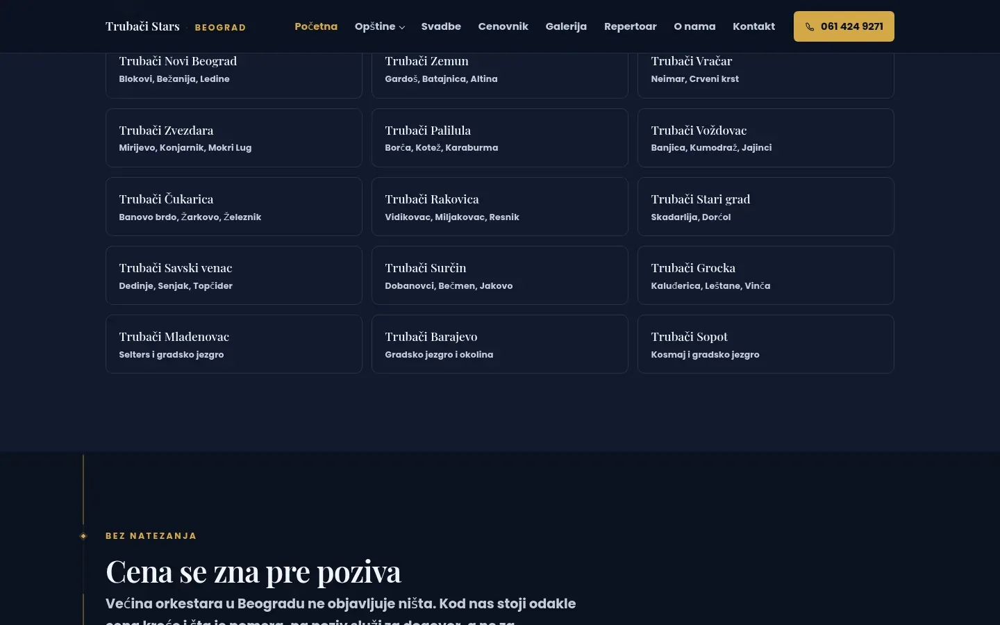

# Trubači Stars Beograd

Belgrade site for the Trubači Stars brass band, rebuilt on a neglected second domain with a page for each of 15 municipalities.

**[trubaci-trubacizasvadbe.rs](https://trubaci-trubacizasvadbe.rs/)** · [Case study (in Serbian)](https://svilenkovic.com/radovi/trubaci-stars-svadbe) · [Srpski](README.sr.md)

> [!NOTE]
> Client project. The source code belongs to the client and stays in a private repository. This page describes what I built and how.

<table>
  <tr><td><b>Client</b></td><td>Trubači Stars</td></tr>
  <tr><td><b>Industry</b></td><td>Brass band for weddings and celebrations</td></tr>
  <tr><td><b>Location</b></td><td>Belgrade, Serbia</td></tr>
  <tr><td><b>Type</b></td><td>Multi-page website</td></tr>
  <tr><td><b>My role</b></td><td>Redesign, development, migration, hosting and maintenance</td></tr>
  <tr><td><b>Stack</b></td><td>PHP 8.3, nginx, vanilla JS, AVIF/WebP, JSON-LD</td></tr>
</table>

## About the project

The band already had two domains competing for the same searches, and the client wanted a third. Fourteen days of Search Console data and logs showed the domain meant for weddings getting about twenty organic clicks. For wedding queries Google ranked the other site, because sixty town pages on both domains carried the same H1. Instead of a third domain, I emptied this one and rebuilt it as a site for Belgrade only, leaving the rest of Serbia and every other occasion to the sister site.

Fifteen municipal pages that differ only by name look to Google like one page repeated, so each names its own neighbourhoods and the practical side of getting there: parking in a Novi Beograd block is a different problem from a narrow lane in Grocka. After writing them I measured the overlap in five-word runs, about nine percent on average and fourteen at most. The old site's sixty-odd town pages went to the sister site through a 301 map. First I removed five older redirects pointing the other way, which would have made a loop.

## What I built

- 28 pages, among them a Belgrade hub, 15 municipal pages, a wedding protocol page, a price page and two buying guides
- Shared includes and three helpers, with FAQ markup built from the same array as the questions on the page
- One CSS file of about 30 KB and one script of about 7 KB, with icons in an inline SVG sprite instead of an icon font
- A gold line drawn by scrolling in CSS alone, which stays static where scroll-driven animation is not supported
- Entrance animations only for elements below the fold, so the price page headline no longer waits for a deferred script
- A `tel:` click counter that writes one line to a rotating log, without cookies or a third-party tool

## Results

| | Performance | Accessibility | Best practices | SEO |
| :-- | :-: | :-: | :-: | :-: |
| Mobile | 99 | 100 | 100 | 100 |
| Desktop | 99 | 100 | 100 | 100 |

PageSpeed Insights, lab test of the live site, September 2026. Security headers: 6 of 6. HTML validator: no errors. axe accessibility check: no violations. Structured data: `FAQPage`, `MusicGroup`, `Service`.

## Screenshots

<table>
  <tr>
    <td width="68%" valign="top"></td>
    <td width="32%" valign="top"></td>
  </tr>
</table>

Weddings, slava feasts, christenings and birthdays: weddings stay here, the rest link to the sister site

Price known before you call: the reason the price list was written in the first place

---

Built by [D. Svilenković](https://svilenkovic.com).
